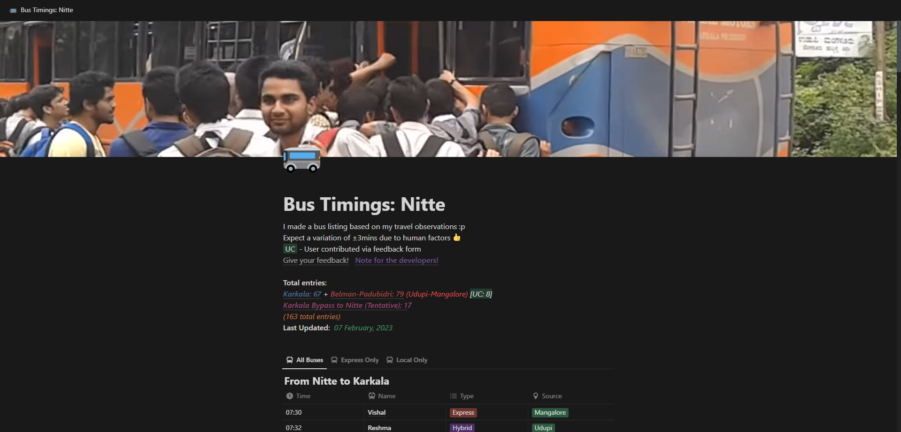

# NitteStop-CSV
 

This repository stores CSV files containing the bus timings for Nitte which has been extracted form the [Notion website](https://bit.ly/NitteStop). The files include details such as departure and arrival times, the bus name, and the route. 
The CSV files are updated along with the Notion website to ensure accuracy of the data, and are organized in an easy-to-use format.

Last Updated: 09 December, 2023

Total entries: 177

## License
The data in this repository is licensed under the Creative Commons Attribution 4.0 International (CC BY 4.0) license. This means you are free to use, distribute, and build upon the data, even for commercial purposes, as long as you give appropriate credit to the original creator (mentioning the repository).

For more information about the CC BY 4.0 license, please visit [Creative Commons](https://creativecommons.org/licenses/by/4.0/).
